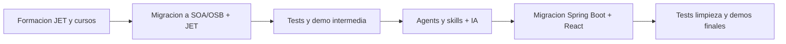
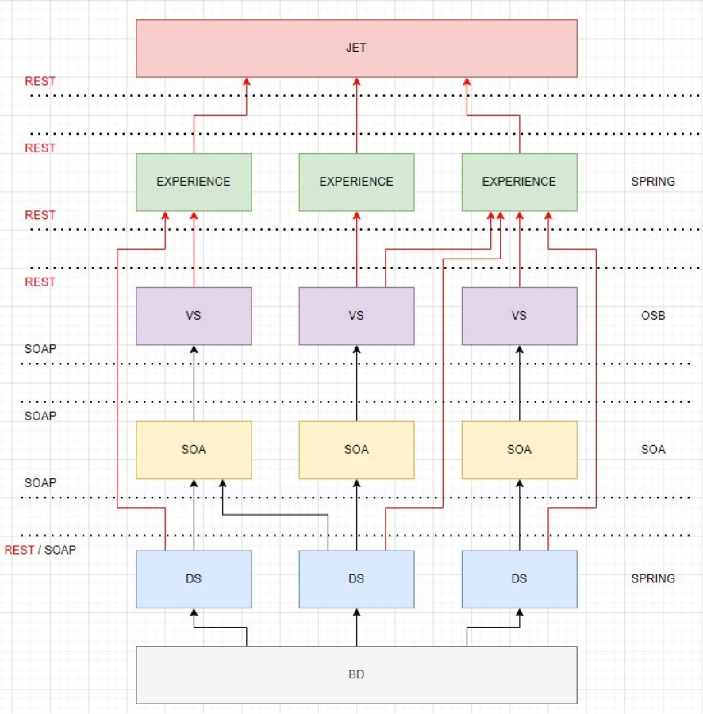
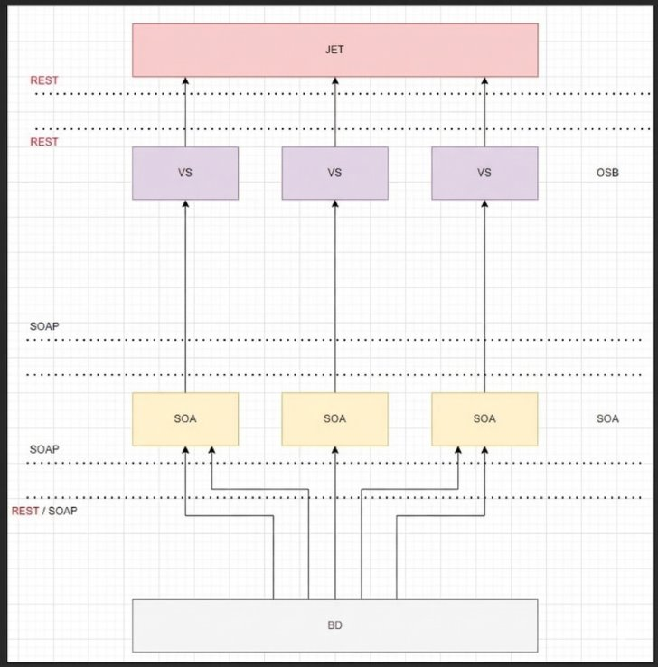
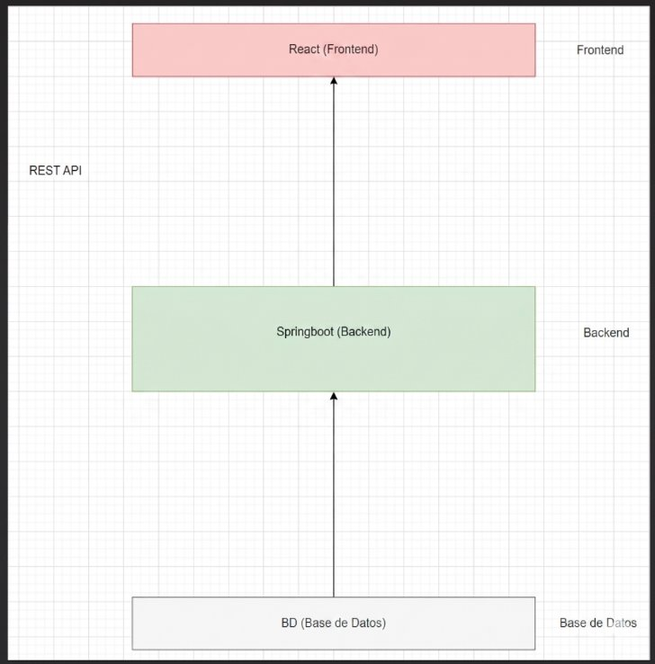
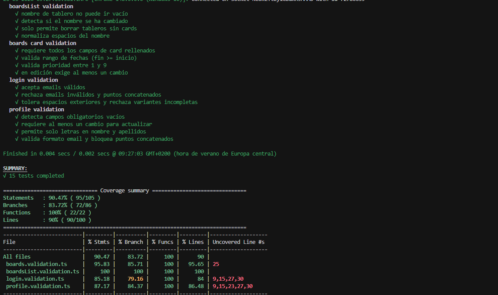
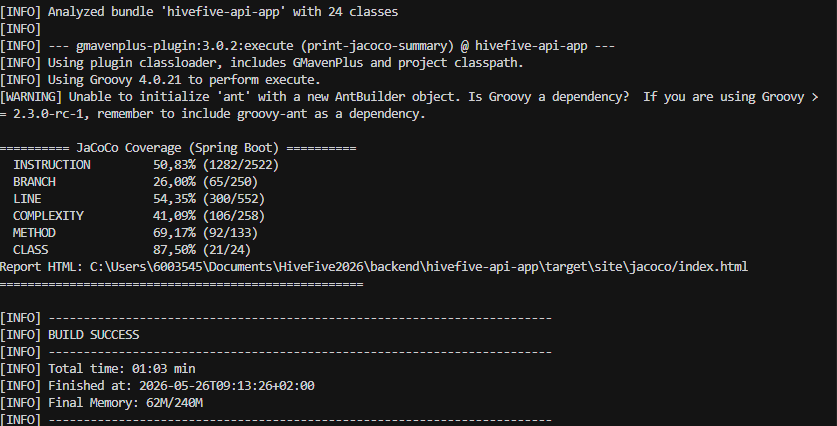
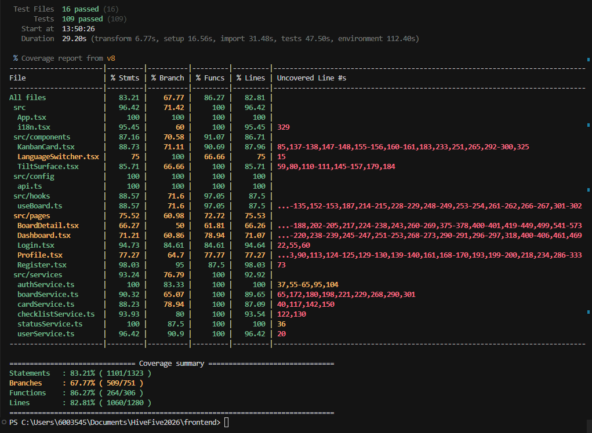

# Prácticas Dual — Viewnext

**2º DAM · Turno de mañana · Nuestro CPIFP Alan Turing (Málaga - PTA) · Curso 2025/2026**

Álvaro Jiménez Muñoz · José Antonio Domínguez González

---

## Datos de nuestra entrega

| Campo | Detalle |
|-------|---------|
| **Nuestro centro** | CPIFP Alan Turing (Málaga - PTA) |
| **Ciclo formativo** | 2º DAM — Desarrollo de Aplicaciones Multiplataforma |
| **Turno** | Mañana |
| **Curso académico** | 2025 / 2026 |
| **Empresa de acogida** | Viewnext |
| **Sede de prácticas** | Málaga — Edificio The Green Ray, Bulevar Louis Pasteur, 47, Campanillas, 29010 |
| **Periodo en empresa** | Enero 2026 – Mayo 2026 |
| **Modalidad** | Formación dual |
| **Repositorio** | [Almucero/Dual-ViewNext-2DAM](https://github.com/Almucero/Dual-ViewNext-2DAM) |
| **Participantes** | José Antonio Domínguez González · Álvaro Jiménez Muñoz |

> **Guía rápida**  
> En este README recogemos todo lo de nuestra estancia dual en Viewnext: la empresa, el calendario completo de las 17 semanas, qué hizo cada uno de nosotros, los módulos DAM, el IPE II, los minutajes del vídeo y el material del repositorio. Lo hemos preparado como entrega principal de nuestra formación en el **CPIFP Alan Turing** (evaluación no presencial). La [presentación en Gamma](https://gamma.app/docs/Presentacion-de-Formacion-Dual-en-Viewnext-dr3ox64o02jse51?mode=doc) y el [vídeo grabado en oficina](recursos/presentación/videopracticas.mp4) complementan la parte visual.

### Cómo está organizado este README

| Bloque | Contenido |
|--------|-----------|
| **Vídeo y presentación** | Dónde ver la exposición (recomendado: vídeo con nosotros explicando) y diapositivas |
| **Trabajo conjunto** | Viewnext, metodología, tecnologías y **17 semanas** de calendario (desplegable) |
| **José Antonio Domínguez González** | Cronograma, herramientas, módulos, IPE II (Basuraless) y valoración |
| **Álvaro Jiménez Muñoz** | Cronograma, herramientas, módulos, IPE II (Bosque Viewnext) y valoración |
| **Material anexo** | Índice único en [Material del repositorio](#material-del-repositorio): certificados, vídeos e imágenes |

## Índice

| N.º | Sección |
|-----|---------|
| 1 | [Vídeo de exposición](#vídeo-de-exposición) |
| 2 | [Presentación (Gamma, PPTX, vídeo)](#presentación) |
| 3 | [Evaluación individual y trabajo conjunto](#evaluación-individual-y-trabajo-conjunto) |
| 4 | [Parte común de empresa](#parte-común-de-empresa) — [Calendario semanal](#trabajo-por-semana) |
| 5 | [José Antonio Domínguez González](#actividad-individual-de-josé-antonio-domínguez-gonzález) |
| 6 | [Álvaro Jiménez Muñoz](#actividad-individual-de-álvaro-jiménez-muñoz) |
| 7 | [Material del repositorio](#material-del-repositorio) |

---

## Vídeo de exposición

Hemos grabado la exposición en un único vídeo: primero la parte común de empresa y después la parte individual de cada uno. Los minutajes están en la tabla.

| Aspecto | Detalle |
|---------|---------|
| **Formato** | Vídeo en las oficinas de Viewnext, explicando en directo (no solo diapositivas en silencio) |
| **Archivo** | [`recursos/presentación/videopracticas.mp4`](recursos/presentación/videopracticas.mp4) |
| **Duración total** | **15 min** |

### Índice de minutajes (un solo vídeo)

| Tramo | Intervalo | Contenido | Enlace al archivo |
|-------|-----------|-----------|-------------------|
| **Parte común (empresa)** | `00:00` – `04:36` | Introducción a Viewnext, metodología ágil, proyecto HiveFive y cronograma macro | [`videopracticas.mp4`](recursos/presentación/videopracticas.mp4) |
| **José Antonio Domínguez González** | `04:36` – `09:40` | Trabajo individual: demostraciones GET/DELETE, listados, tests y valoración | [`videopracticas.mp4`](recursos/presentación/videopracticas.mp4) |
| **Álvaro Jiménez Muñoz** | `09:40` – `15:00` | Trabajo individual: demostraciones POST/PUT, creación/edición, migraciones y valoración | [`videopracticas.mp4`](recursos/presentación/videopracticas.mp4) |

> Para ir directo a cada parte, adelantar el reproductor al minuto indicado.

### Parte individual de cada uno

- **José Antonio Domínguez González:** tramo **04:36 – 09:40** de [`recursos/presentación/videopracticas.mp4`](recursos/presentación/videopracticas.mp4)
- **Álvaro Jiménez Muñoz:** tramo **09:40 – 15:00** de [`recursos/presentación/videopracticas.mp4`](recursos/presentación/videopracticas.mp4)

---

## Presentación

| Prioridad | Formato | Enlace | Notas |
|-----------|---------|--------|-------|
| **1** | Gamma (online) | [Presentación FP Dual Viewnext](https://gamma.app/docs/Presentacion-de-Formacion-Dual-en-Viewnext-dr3ox64o02jse51?mode=doc) | Diseño y navegación correctos |
| **2** | Vídeo con nosotros | [`recursos/presentación/videopracticas.mp4`](recursos/presentación/videopracticas.mp4) | Explicación hablada; referencia principal junto a este README |
| **3** | PPTX (respaldo) | [`recursos/presentación/presentacion.pptx`](recursos/presentación/presentacion.pptx) | Puede alterar estilos respecto a Gamma |

> Lo que contamos en la presentación lo ampliamos por escrito en las secciones de abajo. Las exportaciones por tema de cada uno y el resto de archivos están en [Material del repositorio](#material-del-repositorio).

---

## Evaluación individual y trabajo conjunto

Hemos compartido la **misma célula ágil (Scrum)** de la división Oracle y el mismo proyecto (**HiveFive**), pero cada uno tiene su parte bien delimitada. Por eso hemos separado en este README lo común de lo individual, tal como pide la entrega de nuestra dual en el centro.

| Criterio de diferenciación | Descripción |
|----------------------------|-------------|
| **Asignaciones en Jira** | Tickets propios dentro del mismo sprint y del mismo producto |
| **Entregas en repositorio** | Commits y tareas cerradas de forma individual |
| **Vídeo de exposición** | Tramos de minutaje con el nombre de cada uno |
| **Vídeos en `jose/` y `alvaro/`** | Exportaciones por tema de la exposición — índice en [Material del repositorio](#vídeos) |
| **Demostraciones (“técnica del espejo”)** | Álvaro: **POST/PUT** (creación/edición). José: **GET/DELETE** (consultas, listados, borrado) |
| **Documentación escrita** | Secciones individuales con cronograma, módulos, IPE II y valoración |

El **calendario semanal** (común) está más abajo. En el **vídeo** dimos una visión general; en el **README** detallamos la temporalización y los módulos con más profundidad.

---

# Parte común de empresa

Aquí recogemos lo que compartimos en la estancia: contexto de Viewnext, metodología, tecnologías del proyecto y evolución semana a semana.

## Introducción a la empresa
Viewnext es una empresa de tecnología orientada al desarrollo de soluciones digitales para clientes. Su trabajo abarca distintas fases del ciclo de vida del software, desde el análisis de necesidades hasta el diseño, desarrollo, integración y validación de soluciones reales.

También es una empresa de referencia en el **ecosistema digital empresarial**, dedicada a transformar ideas en productos y soluciones de software con impacto real. Durante las prácticas hemos trabajado en un **entorno de producción activo**, con retos técnicos complejos y aprendizaje continuo, y hemos colaborado con equipos interdepartamentales con perfiles especializados.

**Sede de prácticas (Málaga):** Edificio The Green Ray, Bulevar Louis Pasteur, 47, Campanillas, 29010 Málaga.

Hemos desarrollado la actividad en la oficina de Málaga, donde hemos conocido de primera mano cómo funciona un entorno profesional, la organización por equipos y el trabajo ágil. El día a día ha incluido reuniones de seguimiento, coordinación técnica, planificación de tareas y revisión del trabajo realizado.

### Presencia y ámbito de la empresa

Viewnext cuenta con una **amplia presencia en la península ibérica**, con múltiples oficinas y centros de investigación repartidos por el territorio. Nos hemos centrado en la sede malagueña, dentro de ese contexto corporativo más amplio.

### Servicios principales de Viewnext

| Área | Descripción |
|------|-------------|
| **Inteligencia artificial** | Soluciones de IA generativa orientadas a innovación, personalización y toma de decisiones basada en datos, con foco en eficiencia operacional y análisis de datos. |
| **Ciberseguridad** | Protección informática; la empresa dispone de certificación **PINAKES** para entidades del sector financiero, con cumplimiento normativo específico. |
| **Desarrollo de aplicaciones** | Más de **1.500 profesionales** en tecnologías como Java, .NET, COBOL, SOA/SOAP, Oracle, Spring Boot y React, con mantenimiento y desarrollo continuo de soluciones para clientes. |

## Cómo trabajamos en la empresa

En la célula hemos seguido **Scrum** con los eventos habituales:

| Evento | Finalidad |
|--------|-----------|
| **Daily / daily standups** | Sincronización diaria, avance y bloqueos técnicos |
| **Sprint planning** | Estimación y planificación de tareas por iteración |
| **Demos** | Presentación del incremento de trabajo ante equipo y tutores |
| **Retrospectivas** | Revisión del proceso y mejora continua |

Así hemos visto cómo se estructura el trabajo en una empresa tecnológica real y cómo se coordinan distintos perfiles dentro de un mismo proyecto.

### Principales tecnologías del proyecto

Además del stack concreto de **HiveFive**, en la formación y en el día a día hemos usado:

| Tecnología / herramienta | Rol en el contexto de prácticas |
|--------------------------|----------------------------------|
| **Oracle SOA Suite** | Plataforma empresarial de orquestación e integración de servicios. |
| **Oracle SOA** | Arquitectura orientada a servicios para sistemas empresariales escalables. |
| **Oracle OSB** | Capa de virtualización y mediación de servicios entre sistemas. |
| **Oracle JET** | Marco JavaScript para aplicaciones web responsivas (fase formativa y migración). |
| **React** | Interfaces de usuario dinámicas en la fase de modernización. |
| **Spring Boot** | Microservicios y backend migrado desde SOA/OSB. |
| **Postman y Bruno** | Prueba, documentación y validación de APIs. |
| **Figma** | Prototipado de interfaces antes de la implementación. |
| **Agentes, skills e IA** | Asistencia al desarrollo y a las migraciones de código en IDEs compatibles. |

### Proyecto HiveFive (hilo conductor de la estancia)

**HiveFive** es una aplicación corporativa tipo **Trello** para gestión de tareas y proyectos, desarrollada en ediciones anteriores de prácticas con **Oracle JET**, **SOA/OSB** y parte en **Spring Boot**. Durante esta dual hemos recorrido un ciclo formativo completo:



1. **Formación** en stack Oracle y retos JET.  
2. **Migración** del producto hacia SOA/OSB + JET (eliminando Spring Boot en esa fase).  
3. **Tests** y demo ante tutores.  
4. **Nueva migración** hacia **Spring Boot + React** con agentes y skills de IA.  
5. **Cierre** con pruebas, documentación (Bruno), mejoras y entregables de fin de prácticas.



Estado previo a las migraciones: [`hivefive_previo.mp4`](recursos/videos/hivefive_previo.mp4). Fase intermedia SOA/OSB + JET:



Arquitectura final tras Spring Boot + React:



Estado migrado en vídeo: [`hivefive_migrado.mp4`](recursos/videos/hivefive_migrado.mp4).

---

## Trabajo por semana

Calendario de nuestra estancia (**semanas 1 a 17**). Cada bloque se puede desplegar para ver, día a día, las actividades, resúmenes y hitos del proyecto.

**Leyenda:** además de la tarea principal, en muchas semanas hubo **Sprint Planning**, **Demo/Retro** o preparación de demostraciones ante tutores.

| Semana | Fechas aprox. | Hilo conductor |
|--------|---------------|----------------|
| **1** | 23 ene | Incorporación |
| **2** | 26–30 ene | Cursos y retos JET |
| **3** | 2–6 feb | JET + SOA |
| **4** | 9–13 feb | SOA / inicio OSB |
| **5** | 16–20 feb | OSB, Docker, Figma |
| **6** | 2–6 mar | Inicio HiveFive SOA/OSB |
| **7** | 9–13 mar | CRUDs backend |
| **8** | 16–20 mar | Frontend JET + tests |
| **9** | 23–27 mar | Tests OSB + demo |
| **10** | 7–10 abr | Agents + Spring Boot |
| **11** | 13–17 abr | Migración backend |
| **12** | 20–24 abr | JET → React |
| **13** | 27–30 abr | Tests y limpieza |
| **14** | 4–8 may | Mejoras UI |
| **15** | 11–15 may | Ensayos demo |
| **16** | 18–22 may | Demo final |
| **17** | 25–28 may | Entregable y vídeo |

> Despliega cada bloque **«Semana N»** más abajo para ver el detalle día a día.

---

<details>
<summary><strong>Semana 1 — 23 de enero de 2026</strong></summary>

| Día | Actividad |
|-----|-----------|
| **23** | Recepción de material e introducción al entorno de prácticas |

**Resumen:** Primera jornada en Viewnext. Entrega de equipamiento, accesos y presentación inicial del periodo dual, con primer contacto con la organización del trabajo y los tutores laborales.

---

</details>

---

<details>
<summary><strong>Semana 2 — 26 al 30 de enero de 2026</strong></summary>

| Día | Actividad |
|-----|-----------|
| **26** | Cursos obligatorios + **Arranque Beca 2026** |
| **27** | Cursos complementarios |
| **28** | Retos **Oracle JET** |
| **29** | Retos **Oracle JET** |
| **30** | Retos **Oracle JET** |

**Cursos obligatorios:** Prevención de riesgos laborales, gestión medioambiental y seguridad de la información. Certificados en [Material del repositorio → Certificados](#certificados).

**Cursos complementarios:** Prompting efectivo, IA generativa e **Introducción a los servicios web** (curso con ese nombre; distinto del curso de **OpenAPI**).

**Arranque Beca 2026:** Presentación general con distintos miembros de la empresa, compañeros de prácticas y tutores laborales.

**Retos JET:** Despliegue del entorno local de desarrollo y creación de **Web Components** sobre la estructura `jet-composites`, como primer acercamiento práctico a Oracle JET.

---

</details>

---

<details>
<summary><strong>Semana 3 — 2 al 6 de febrero de 2026</strong></summary>

| Día | Actividad |
|-----|-----------|
| **2** | Retos JET + **Sprint Planning** |
| **3** | Retos JET |
| **4** | Formación de servicios web + preparación de presentación para Demo |
| **5** | Preparación de entorno Oracle para SOA/OSB (JDeveloper) + Demo/Retro |
| **6** | Formación **SOA** |

**Retos JET:** Implementación de estados dinámicos (view, create, edit, delete) con lógica de lectura/escritura en el formulario `demo-update`. Integración de selectores multimedia con previsualización e intercambio de datos mediante objetos e hilos de eventos. Migración del flujo de datos a `CollectionDataProvider` y encapsulado modular del componente dentro de un contenedor `oj-dialog`.

**Formación de servicios web:** Curso de iniciación a servicios web y consulta de documentación en línea.

**Formación SOA:** Prácticas guiadas explorando el entorno siguiendo una guía interna de la empresa.

---

</details>

---

<details>
<summary><strong>Semana 4 — 9 al 13 de febrero de 2026</strong></summary>

| Día | Actividad |
|-----|-----------|
| **9** | Formación SOA |
| **10** | Formación SOA + **Sprint Planning** |
| **11** | Formación SOA |
| **12** | Formación SOA |
| **13** | Formación **OSB** |

**Formación SOA/OSB:** Consolidación de conceptos de arquitectura orientada a servicios y prácticas en el entorno Oracle. La formación en **OSB** (Oracle Service Bus) comienza el viernes con ejercicios guiados de mayor complejidad y extensión que los de SOA.

---

</details>

---

<details>
<summary><strong>Semana 5 — 16 al 20 de febrero de 2026</strong></summary>

| Día | Actividad |
|-----|-----------|
| **16** | Formación OSB |
| **17** | Formación OSB |
| **18** | Formación OSB + preparación de presentación para Demo |
| **19** | Dockerización de entorno JDeveloper + Demo/Retro |
| **20** | Documentación del contenedor Docker + desarrollo en **Figma** |

**Formación OSB:** Continuación de prácticas guiadas, más complejas y extensas que en SOA.

**Dockerización de JDeveloper:** Empaquetado del entorno de desarrollo Oracle para SOA/OSB (JDeveloper) y sus dependencias en un **contenedor Docker** descargable, simplificando el proceso de instalación para cualquier miembro del equipo.

**Documentación Docker:** Redacción de guía clara de puesta en marcha del entorno dockerizado, con soluciones a errores frecuentes.

**Desarrollo en Figma:** Tras acordar en sprint planning el desarrollo de una web concreta con las tecnologías vistas, se diseñó previamente el prototipo visual en Figma antes de implementarlo.

---

</details>

---

<details>
<summary><strong>Semana 6 — 2 al 6 de marzo de 2026</strong></summary>

| Día | Actividad |
|-----|-----------|
| **2** | Recepción e inicio de migración del proyecto **HiveFive** |
| **3** | SOA/OSB CRUDs + **Sprint Planning** |
| **4** | SOA/OSB CRUDs |
| **5** | SOA/OSB CRUDs |
| **6** | SOA/OSB CRUDs |

**HiveFive:** Proyecto tipo Trello de gestión de tareas, desarrollado en ediciones anteriores de la dual en Viewnext con **SOA/OSB/JET** y parte en **Spring Boot**. Nuestro objetivo fue migrar toda la lógica de Spring Boot a **SOA/OSB**, eliminando Spring Boot del stack.

**SOA/OSB CRUDs:** Para la migración fue necesario reimplementar desde cero la lógica exclusiva de Spring Boot en CRUDs SOA/OSB (por aprendizaje y por ser más manejable que retomar código incompleto). Cada CRUD cuenta con un proyecto SOA y un proyecto OSB independientes, conectados entre sí.

---

</details>

---

<details>
<summary><strong>Semana 7 — 9 al 13 de marzo de 2026</strong></summary>

| Día | Actividad |
|-----|-----------|
| **9** | SOA/OSB CRUDs |
| **10** | SOA/OSB CRUDs + **Sprint Planning** |
| **11** | Mejoras, arreglos y refinamientos en nuevo backend (SOA/OSB) |
| **12** | Mejoras, arreglos y refinamientos en nuevo backend (SOA/OSB) |
| **13** | Adaptación del frontend en **JET** al nuevo backend |

**Refinamiento del backend:** Verificación de que el nuevo backend y sus endpoints funcionan correctamente y están listos para integrarse con el frontend.

**Adaptación del frontend JET:** Eliminación de la lógica asociada a Spring Boot y conexión con el nuevo backend SOA/OSB hasta recuperar la funcionalidad original de las pantallas.

---

</details>

---

<details>
<summary><strong>Semana 8 — 16 al 20 de marzo de 2026</strong></summary>

| Día | Actividad |
|-----|-----------|
| **16** | Adaptación frontend JET + reunión sobre objetivos del equipo |
| **17** | Mejoras en frontend JET |
| **18** | Mejoras en frontend JET |
| **19** | Mejoras en frontend JET + preparación de presentación para Demo |
| **20** | **SOA & JET TESTS** + Demo |

**Mejoras en frontend JET:** Tras completar la migración, nuevas funcionalidades y mejoras: sistema y pantalla de login, tableros, datos esqueleto (skeleton) en carga y otras mejoras estéticas y funcionales.

**SOA & JET TESTS:** Tests de integración en SOA (único tipo viable en ese entorno) y tests unitarios y de funcionamiento de pantallas en JET.



---

</details>

---

<details>
<summary><strong>Semana 9 — 23 al 27 de marzo de 2026</strong></summary>

| Día | Actividad |
|-----|-----------|
| **23** | SOA & JET TESTS |
| **24** | SOA & JET TESTS + **Sprint Planning** |
| **25** | **OSB TESTS** |
| **26** | **DEMO** |
| **27** | Establecimiento de nuevos objetivos |

**OSB TESTS:** Documentación de todos los endpoints y formas de invocarlos para prueba en **Postman**, incluyendo escenarios diversos (por ejemplo, crear un recurso con un identificador ya existente).

**DEMO:** Gran exposición ante tutores laborales del resultado de la migración de HiveFive a SOA/OSB y JET.

**Nuevos objetivos:** Tras completar la migración a tecnologías Oracle, se plantea migrar el proyecto entero a **Spring Boot** y **React** con apoyo de IA; el trabajo en SOA/OSB/JET queda versionado como referencia y como fase formativa.

---

</details>

---

<details>
<summary><strong>Semana 10 — 7 al 10 de abril de 2026</strong></summary>

| Día | Actividad |
|-----|-----------|
| **7** | **IDE Agents & Skills** |
| **8** | IDE Agents & Skills + preparación de presentación para Demo |
| **9** | SOA/OSB → **Spring Boot** + Demo |
| **10** | SOA/OSB → Spring Boot |

**IDE Agents & Skills:** Desarrollo de agentes, skills y configuraciones para IDEs compatibles, orientados a ejecutar las migraciones de forma componentizada y siguiendo estándares acordados.


**SOA/OSB → Spring Boot:** Inicio de la migración del backend apoyándose en esos agentes.

---

</details>

---

<details>
<summary><strong>Semana 11 — 13 al 17 de abril de 2026</strong></summary>

| Día | Actividad |
|-----|-----------|
| **13** | SOA/OSB → Spring Boot |
| **14** | SOA/OSB → Spring Boot |
| **15** | SOA/OSB → Spring Boot |
| **16** | **Spring Boot TESTS** |
| **17** | Spring Boot TESTS |

**Migración backend:** Migración componente a componente de SOA/OSB a Spring Boot, verificando paridad funcional.

**Spring Boot TESTS:** Dos suites: pruebas **unitarias** sin base de datos y pruebas de **integración** con conexión a BD, ejecutables sin riesgo de ensuciar datos de prueba. Desarrollo asistido por agentes y skills.



---

</details>

---

<details>
<summary><strong>Semana 12 — 20 al 24 de abril de 2026</strong></summary>

| Día | Actividad |
|-----|-----------|
| **20** | **JET → React** |
| **21** | JET → React + **Sprint Planning** |
| **22** | JET → React |
| **23** | JET → React |
| **24** | **React TESTS** |

**JET → React:** Migración pantalla a pantalla y componente a componente del frontend, con mejora del diseño visual aprovechando la stack moderna.

**React TESTS:** Comprobación de la migración y tests unitarios y de funcionamiento de la aplicación web, también con skills y agentes especializados.



---

</details>

---

<details>
<summary><strong>Semana 13 — 27 al 30 de abril de 2026</strong></summary>

| Día | Actividad |
|-----|-----------|
| **27** | React TESTS |
| **28** | Limpieza del proyecto y nueva documentación |
| **29** | Mejoras de diseño y funcionalidad en frontend migrado |
| **30** | Mejoras de diseño y funcionalidad en frontend migrado |

**Limpieza y documentación:** Eliminación de referencias a la estructura antigua en la rama activa (código legacy versionado pero no presente en la versión actual). Nueva documentación adaptada al proyecto, incluyendo documentación detallada del backend en **Bruno**.

---

</details>

---

<details>
<summary><strong>Semana 14 — 4 al 8 de mayo de 2026</strong></summary>

| Día | Actividad |
|-----|-----------|
| **4** | Mejoras de diseño y funcionalidad en frontend migrado |
| **5** | Mejoras en frontend + **Sprint Planning** |
| **6** | Preparación de **DEMO final** |
| **7** | Preparación de DEMO final |
| **8** | Preparación de DEMO final |

**Mejoras en frontend:** Con el proyecto migrado, limpio y funcional, optimización de diseño, funcionalidad y rendimiento, evolucionando respecto al proyecto inicial hacia un resultado más pulido.

**Preparación DEMO final:** Elaboración de la presentación del proyecto de migración y del trabajo del periodo de prácticas para tutores y dirección.

---

</details>

---

<details>
<summary><strong>Semana 15 — 11 al 15 de mayo de 2026</strong></summary>

| Día | Actividad |
|-----|-----------|
| **11** | Preparación de DEMO final |
| **12** | DEMOs de prueba y ajustes en la presentación |
| **13** | DEMOs de prueba y ajustes en la presentación |
| **14** | DEMOs de prueba y ajustes en la presentación |
| **15** | DEMOs de prueba y ajustes en la presentación |

**Ensayos de DEMO:** Práctica de la presentación ante tutores y entre el equipo, refinando el guion, el material visual y los posibles cambios pendientes en la aplicación.

---

</details>

---

<details>
<summary><strong>Semana 16 — 18 al 22 de mayo de 2026</strong></summary>

| Día | Actividad |
|-----|-----------|
| **18** | **DEMO final** |
| **19** | Mejoras en HiveFive + **Sprint Planning** |
| **20** | Mejoras en HiveFive |
| **21** | Mejoras en HiveFive |
| **22** | Mejoras en HiveFive |

**DEMO final:** Presentación **en tiempo real**, de manera **visual** y **cara a cara**, de las distintas etapas de migración y de la formación recibida, ante tutores laborales y altos cargos de la empresa.

**Mejoras en HiveFive:** Tras la demo, continuación de mejoras anotadas previamente o surgidas durante la presentación (por ejemplo, templates en Spring Boot o integración de IA interna de la empresa en el frontend).

---

</details>

---

<details>
<summary><strong>Semana 17 — 25 al 28 de mayo de 2026</strong></summary>

| Día | Actividad |
|-----|-----------|
| **25** | Preparación de presentación de prácticas y entregable |
| **26** | Preparación de presentación de prácticas y entregable |
| **27** | Grabación del vídeo de exposición de las prácticas |
| **28** | Entrega de equipos y despedida |

**Cierre del periodo dual:** Preparamos la presentación y este README, grabamos el vídeo conjunto en las oficinas de Viewnext y devolvimos el material.

---

</details>

---

### Resumen por fases

| Fase | Periodo aproximado | Enfoque principal |
|------|-------------------|-----------------|
| **Incorporación y formación JET** | Ene 2026 | Cursos corporativos, retos JET, arranque Beca 2026 |
| **Formación SOA/OSB e infraestructura** | Feb 2026 | SOA, OSB, servicios web, Docker + JDeveloper, Figma |
| **HiveFive en stack Oracle** | Mar 2026 | CRUDs SOA/OSB, frontend JET, tests, demo intermedia |
| **Agents, skills y migración moderna** | Abr–May 2026 | Spring Boot, React, tests, limpieza, demos y cierre |

> Certificados, vídeos exportados de la exposición y demos complementarias: [Material del repositorio](#material-del-repositorio).

---
# Actividad individual de José Antonio Domínguez González

| | |
|--|--|
| **Vídeo individual** | Minutos **04:36 – 09:40** · [`videopracticas.mp4`](recursos/presentación/videopracticas.mp4) |
| **Parte común (compartida)** | Minutos **00:00 – 04:36** del mismo archivo |
| **Enfoque en demostraciones** | Operaciones **GET/DELETE**, listados, tableros y tests |
| **Vídeos y certificados** | [Material del repositorio](#material-del-repositorio) · carpeta [`recursos/videos/jose/`](recursos/videos/jose/) |

---

## Resumen de la actividad realizada

Durante mi estancia en Viewnext he participado en un itinerario progresivo que ha combinado formación técnica, integración en la dinámica del equipo, desarrollo de tareas prácticas, pruebas y participación en procesos de migración tecnológica.

**Evolución por periodos:**
- **01/2026 - 02/2026:** Formación en **Oracle JET**
- **02/2026 - 03/2026:** Formación en **SOA y OSB**
- **02/2026 - 03/2026:** Trabajo sobre **HiveFive** en **JET** y **SOA & OSB**
- **03/2026 - 04/2026:** **Pruebas y validaciones** sobre **SOA** y **JET**
- **04/2026:** Trabajo relacionado con **agents and skills**
- **04/2026 - 05/2026:** **Migración de backend** de **SOA y OSB** a **Spring Boot**
- **04/2026 - 05/2026:** **Migración de frontend** de **JET** a **React**
- **04/2026 - 05/2026:** **Pruebas** sobre **Spring Boot** y **React**

## Temporalización individual por fases

Calendario detallado día a día (común al equipo) en [Trabajo por semana](#trabajo-por-semana). A continuación, el **foco de mi aportación** por periodo:

| Periodo | Semanas aprox. | Actividad principal (José) |
|---------|----------------|----------------------------|
| Incorporación y formación | 1–2 (ene) | Cursos corporativos, retos JET iniciales, integración en dailies |
| Servicios Oracle | 3–5 (feb) | Formación SOA/OSB; documentación de endpoints y pruebas en **Postman** |
| HiveFive stack Oracle | 6–9 (mar) | CRUDs y tests en SOA/OSB/JET; **GET/listados**, adaptación frontend JET al backend Oracle |
| Agents y migración moderna | 10–13 (abr) | Skills/agents; migración SOA/OSB → Spring Boot; **JET → React** (pantallas de consulta y tableros) |
| Cierre | 14–17 (may) | Tests React/Spring Boot, demo final, preparación y grabación del entregable |

En la grabación del vídeo he mostrado sobre todo operaciones de **lectura y borrado (GET/DELETE)**, listados, dashboards y validación con tests, complementando el trabajo de mi compañero en creación/edición. Mis exportaciones por tema están en [Material del repositorio → José](#vídeos-de-josé-antonio-domínguez-gonzález); entre las demos generales, las que más encajan con mi parte son **soa_tests**, **jet_retos** y **hivefive_previo**.

---

## Responsabilidades asumidas

| Ámbito | Responsabilidad |
|--------|-----------------|
| **Equipo** | Participación activa en dailies, planning, demos y retrospectivas |
| **Formación** | Cursos corporativos y aprendizaje de tecnologías Oracle y modernas |
| **Desarrollo** | Tareas prácticas frontend y backend sobre HiveFive |
| **Calidad** | Pruebas y validación de funcionalidades (SOA, JET, Spring Boot, React) |
| **Migración** | Colaboración en migraciones SOA/OSB ↔ Spring Boot y JET → React |
| **Documentación** | Síntesis del aprendizaje y apoyo al entregable final |

---

## Herramientas y tecnologías utilizadas

| Categoría | Herramientas |
|-----------|--------------|
| **Frontend** | Oracle JET, React, Figma |
| **Backend** | Oracle SOA, Oracle OSB, Spring Boot |
| **Pruebas y APIs** | Tests unitarios e integración, Postman, Bruno |
| **Metodología** | Scrum (dailies, sprint planning, demos, retrospectivas) |
| **Gestión y comunicación** | Jira, Trello, Microsoft Teams |
| **IA en desarrollo** | Agentes, skills y prompts para migración y refactorización |
| **Otros** | Docker (entorno JDeveloper del equipo), documentación técnica en inglés |

---

## Conocimientos adquiridos por módulo profesional

Relación entre los módulos del ciclo **2º DAM** y la actividad desarrollada en Viewnext.

### Acceso a Datos

He reforzado mi comprensión sobre cómo se organiza y utiliza la información dentro de una aplicación, entendiendo mejor la relación entre las distintas capas del sistema. He trabajado con modelos y endpoints para alimentar listados, consultas y tableros en **JET** y **React** tras la migración.

### Desarrollo de Interfaces

He trabajado especialmente esta parte con tecnologías de frontend, primero con **Oracle JET** y posteriormente con **React**, además de modulado en **Figma**. El foco ha sido pantallas de consulta, tableros y validación visual de la migración.

### Diseño e Implementación de Infraestructuras de Servicios y APIs

He reforzado conocimientos muy relacionados con integración de servicios, arquitectura y evolución tecnológica del backend, especialmente en el contexto de **SOA**, **OSB** y **Spring Boot**. He documentado y probado endpoints con **Postman** y **Bruno**.

### Inglés Profesional GS

He ampliado vocabulario técnico y comprensión de términos utilizados en herramientas, documentación y contexto profesional. La lectura diaria de documentación oficial y la redacción de mensajes técnicos forman parte del flujo de trabajo en la célula.

### Programación Multimedia y Dispositivos Móviles

Aunque no ha sido el eje principal de la estancia, he aplicado conocimientos relacionados con presentación visual, estructura de interfaces y experiencia de usuario en las pantallas web desarrolladas.

### Programación de Servicios y Procesos

He adquirido experiencia relacionada con servicios, integraciones y lógica de backend, principalmente mediante el trabajo con **SOA**, **OSB** y **Spring Boot**, incluyendo pruebas de integración y validación de operaciones **GET/DELETE**.

### Proyecto Intermodular de Desarrollo de Aplicaciones Multiplataforma

La estancia me ha permitido ver cómo se conectan en un entorno real varias áreas del desarrollo de software — frontend, backend, pruebas, organización y coordinación de equipo — utilizando la metodología ágil y herramientas como **Trello** y **Jira**.

### Sistemas de Gestión Empresarial

He podido observar cómo se organiza el trabajo dentro de una empresa tecnológica, cómo se distribuyen responsabilidades y cómo se coordinan los equipos y proyectos. **HiveFive** es un ejemplo interno de gestión de tareas y sprints.

### Itinerario Personal para la Empleabilidad II

He desarrollado competencias profesionales como la **responsabilidad**, la **puntualidad**, la **comunicación**, la **integración en un equipo** y la **adaptación a un entorno real de trabajo**.

#### Análisis y propuesta de proyecto social sostenible (RA5 y RA2)

**1. Descripción del proyecto existente**

Durante mi periodo de formación en **Viewnext** (Málaga), he conocido la iniciativa corporativa **Basuraless**, un programa de **voluntariado sostenible** impulsado por la empresa en colaboración con empleados y, en algunas ediciones, con entidades locales o asociaciones medioambientales.

La actividad consiste en **jornadas de limpieza y recogida de residuos** en entornos naturales cercanos a la sede: playas, montes, senderos y zonas verdes. Los participantes se organizan en pequeños grupos, reparten zonas de actuación, clasifican los residuos recogidos (plásticos, envases, colillas, etc.) y, al finalizar, comparten una breve valoración de la jornada. Como empresa tecnológica, Viewnext vincula esta acción con su compromiso de **responsabilidad social corporativa (RSC)** y con la concienciación sobre el impacto ambiental, también en el ámbito digital.

**2. Objetivos sociales y medioambientales**

- **Medioambientales:** Reducir la presencia de basura y plásticos en espacios naturales; favorecer la recuperación de entornos degradados; sensibilizar sobre el consumo responsable y el correcto tratamiento de residuos.
- **Sociales:** Fomentar el **voluntariado corporativo**, reforzar el sentido de pertenencia al equipo y acercar a la empresa a la comunidad local mediante una acción visible y colaborativa.
- **Formativos:** Desarrollar actitud proactiva, trabajo en equipo fuera del entorno habitual de oficina y reflexión sobre la sostenibilidad aplicada al sector tecnológico.

**3. Beneficios para la empresa y para la comunidad**

| Ámbito | Beneficios |
|--------|------------|
| **Empresa** | Refuerzo de la imagen corporativa responsable, mejora del clima laboral y de la cohesión entre equipos. |
| **Comunidad** | Espacios naturales más limpios y seguros para el uso ciudadano, reducción de residuos que pueden acabar en entornos naturales, ejemplo de implicación empresarial. |

**4. Mejoras y recomendaciones de implementación**

Propongo complementar **Basuraless** con una acción alineada con el perfil tecnológico de Viewnext:

- **Jornada de recogida de residuos electrónicos (RAEE)** en la sede de **The Green Ray**: punto temporal de recogida de teclados, ratones, cables, cargadores y pequeños periféricos obsoletos de empleados, con canalización a un gestor autorizado de residuos electrónicos.
- **Comunicación previa** mediante canales internos (correo, Teams o tablón de la oficina) con fechas, lista de materiales aceptados y normas de seguridad.
- **Seguimiento de impacto:** registrar kilos recogidos o número de dispositivos entregados y publicar un resumen interno para reforzar la concienciación.

Esta mejora sería coherente con la actividad de la empresa, aprovecharía recursos ya disponibles (espacio en sede, comunicación interna, participación voluntaria) y ampliaría el mensaje sostenible más allá del entorno natural.

**5. Síntesis de observaciones sobre competencias personales, sociales y emocionales**

Durante la estancia he podido observar el funcionamiento interno de Viewnext en aspectos relacionados con la empleabilidad:

- **Trabajo en equipo:** El trabajo se organiza en equipos multidisciplinares con roles definidos (desarrollo, pruebas, coordinación). Las **dailys** permiten alinear el avance diario, en los **sprint planning** se reparten tareas de forma explícita y en las **demos** y **retrospectivas** fomentan la revisión conjunta y la mejora continua. He notado que se valora preguntar, compartir bloqueos y apoyarse entre compañeros cuando surge una duda técnica.
- **Gestión de conflictos:** Los desacuerdos técnicos o de prioridades suelen abordarse en reuniones de equipo, con los responsables de las prácticas y el proyecto, para que nos den las pautas a seguir.
- **Comunicación con la dirección y el equipo:** Existe un canal en teams entre el equipo de desarrollo y con los responsables de las prácticas. La comunicación es directa y profesional, con feedback periódico sobre el trabajo realizado y expectativas.
- **Organización del tiempo y las tareas:** Las tareas se planifican por sprints y se hace seguimiento con herramientas como **Jira** y **Trello**. El trabajo se organiza en **bloques de tiempo fijos (sprints)** y, antes de abordar tareas nuevas, se estima el esfuerzo necesario. El día a día combina formación, desarrollo, pruebas y reuniones breves.

Complementando lo anterior, en el día a día de la célula hemos visto que el **trabajo en equipo** se centra en la misma aplicación (**HiveFive**), repartiendo tareas y avances de forma coordinada. La **comunicación** es continua y fluida, tanto por el chat interno (**Teams**) como de forma directa entre compañeros. Cuando surge un **bloqueo o un cambio de prioridades**, el responsable del equipo o de las prácticas **reubica el trabajo** y marca las pautas a seguir sin que el avance del sprint quede paralizado.

En conjunto, esta experiencia me ha ayudado a entender cómo las competencias personales y sociales (comunicación, trabajo en equipo, gestión del tiempo, resolución de problemas) son tan relevantes como las técnicas para integrarse y progresar en una empresa del sector TIC.

## Valoración personal de la experiencia dual

Mi valoración de la experiencia dual en Viewnext es **muy positiva**. Esta estancia me ha permitido pasar del entorno académico a un entorno profesional real, entendiendo mejor cómo se trabaja dentro de una empresa tecnológica y cómo se organizan los proyectos de software.

A nivel técnico, he podido formarme en tecnologías concretas y participar en tareas reales de desarrollo, pruebas y migración. A nivel personal y profesional, he mejorado en comunicación, adaptación al trabajo en equipo, responsabilidad y organización.

**Opinión final:** Muy positiva; **buen proceso** formativo y **muy buen ambiente** de trabajo.

### Aspectos valorados y puntos de mejora

| Aspectos positivos | Aspectos a mejorar / más exigentes |
|--------------------|-------------------------------------|
| **Entorno real** de producción y responsabilidad sobre software en uso | Tecnologías **legacy** poco extendidas fuera del ecosistema Oracle (**SOA**, **OSB**, **JET**) |
| **Posibilidad de contratación** y continuidad profesional tras la dual | |
| Aprendizaje de tecnologías **actuales y demandadas** (**Spring Boot**, **React**) | |
| **Buen ambiente** y compañerismo en la célula | |
| **Libertad** para proponer mejoras y seguimiento cercano por parte de tutores y equipo | |

---
# Actividad individual de Álvaro Jiménez Muñoz

| | |
|--|--|
| **Vídeo individual** | Minutos **09:40 – 15:00** · [`videopracticas.mp4`](recursos/presentación/videopracticas.mp4) |
| **Parte común (compartida)** | Minutos **00:00 – 04:36** del mismo archivo |
| **Enfoque en demostraciones** | Operaciones **POST/PUT**, creación/edición, Docker, Figma |
| **Vídeos y certificados** | [Material del repositorio](#material-del-repositorio) · carpeta [`recursos/videos/alvaro/`](recursos/videos/alvaro/) |

---

## Resumen de la actividad realizada

Durante mi estancia en Viewnext he participado en el mismo itinerario formativo y de migración que el resto de la célula, con foco en tareas de **creación y edición (POST/PUT)** en backend y frontend, documentación de infraestructura y entregas propias en Jira.

- **01/2026 – 02/2026:** Formación en **Oracle JET** (retos y Web Components)
- **02/2026 – 03/2026:** Formación **SOA/OSB**; **Dockerización de JDeveloper** y guía de despliegue
- **02/2026 – 03/2026:** **HiveFive** — CRUDs SOA/OSB y adaptación **JET** al nuevo backend
- **03/2026 – 04/2026:** Tests SOA/JET/OSB; documentación de endpoints
- **04/2026:** **IDE Agents & Skills** para migraciones estandarizadas
- **04/2026 – 05/2026:** Migración **SOA/OSB → Spring Boot** y **JET → React**
- **04/2026 – 05/2026:** Tests Spring Boot y React; documentación **Bruno**

## Temporalización individual por fases

El [calendario común](#trabajo-por-semana) refleja las actividades del equipo. Resumen de **mi aportación** por periodo:

| Periodo | Semanas aprox. | Actividad principal (Álvaro) |
|---------|----------------|------------------------------|
| Incorporación y formación | 1–2 (ene) | Cursos corporativos (PRL, IA, prompting); retos JET (`demo-update`, `CollectionDataProvider`, `oj-dialog`) |
| Servicios e infraestructura | 3–5 (feb) | SOA/OSB; **contenedor Docker** para JDeveloper + guía de instalación; prototipado **Figma** |
| HiveFive stack Oracle | 6–9 (mar) | Implementación CRUDs SOA/OSB; **POST/PUT**; mejora frontend JET (login, tableros, skeleton) |
| Agents y migración moderna | 10–13 (abr) | Definición de agents/skills; migración a **Spring Boot** y **React** con IA; limpieza y docs **Bruno** |
| Cierre | 14–17 (may) | Mejoras UI/UX, demo final, preparación README y grabación del vídeo de exposición |

En el vídeo de exposición he mostrado principalmente flujos de **creación y edición (POST/PUT)** en SOA/OSB, Spring Boot y React, más retos formativos y Figma. Mis exportaciones por tema están en [Material del repositorio → Álvaro](#vídeos-de-álvaro-jiménez-muñoz); entre las demos generales, las que más encajan con mi parte son **soa_crud**, **bruno** y **hivefive_migrado**.

---

## Responsabilidades asumidas

| Ámbito | Responsabilidad |
|--------|-----------------|
| **Equipo** | Dailies, sprint planning, demos y retrospectivas |
| **Desarrollo** | Componentes full-stack asignados por **Jira** |
| **Infraestructura** | Dockerización de JDeveloper y guía de despliegue |
| **Diseño** | Prototipos en **Figma** acordados en planning |
| **Implementación** | CRUDs y pantallas con foco **POST/PUT** |
| **Migración** | Agents/skills para migraciones repetibles |
| **Entregable** | Documentación técnica y elaboración de este README |

---

## Herramientas y tecnologías utilizadas

| Categoría | Herramientas |
|-----------|--------------|
| **Frontend** | Oracle JET, React, Figma |
| **Backend** | Oracle SOA, Oracle OSB, Spring Boot |
| **Pruebas y APIs** | Tests unitarios e integración, Bruno, Postman |
| **Infraestructura** | Docker (JDeveloper SOA/OSB) |
| **Metodología** | Scrum |
| **Gestión y comunicación** | Jira, Trello, Teams |
| **IA** | Agentes, skills y prompts |
| **Control de versiones** | Git; commits y mensajes en inglés |

---

## Conocimientos adquiridos por módulo profesional

Relación entre los módulos del ciclo **2º DAM** y la actividad desarrollada en Viewnext.

### Acceso a Datos

Adaptación de modelos y endpoints para alimentar interfaces en React tras la migración; trabajo con persistencia y contratos REST en Spring Boot. He practicado cómo se **recoge, transforma y envía la información** desde el servidor hasta la interfaz de usuario, adaptando esos datos para que funcionen correctamente en las pantallas desarrolladas con **React**.

### Desarrollo de Interfaces

Evolución de pantallas en **Oracle JET** a **React**; prototipado en **Figma**; componentes interactivos y mejoras de UX (login, tableros, estados de carga). El foco principal ha sido la **parte visual y la experiencia de usuario**: crear y actualizar pantallas, pasando de diseños antiguos en Oracle a interfaces más modernas e interactivas con React.

### Diseño e Implementación de Infraestructuras de Servicios y APIs

Integración SOA/OSB, exposición de servicios y migración a microservicios Spring Boot; documentación de APIs en Bruno. He aprendido a **conectar sistemas a nivel interno**, comunicando distintas plataformas corporativas mediante las herramientas de integración de **Oracle** (SOA/OSB) y su evolución hacia **Spring Boot**.

### Inglés Profesional GS

Lectura de documentación oficial Oracle/Spring y redacción habitual de commits y mensajes técnicos en inglés. He reforzado el nivel leyendo **documentación técnica oficial a diario** y redactando en inglés los mensajes de **commit** cada vez que subía código al repositorio.

### Programación Multimedia y Dispositivos Móviles

El proyecto en empresa fue web; en tiempo de trabajo autónomo apliqué el módulo desarrollando una **app Android en Kotlin** vinculada al proyecto intermodular del ciclo. Al ser el proyecto de prácticas íntegramente web, aproveché los **tiempos de trabajo autónomo** para programar en Kotlin la aplicación Android nativa del proyecto final del ciclo.

### Programación de Servicios y Procesos

Desarrollo real de lógica de negocio y migración de servicios heredados a **Spring Boot**, con pruebas automatizadas. Trabajé con el **backend en producción**, participando en la migración de código heredado hacia una arquitectura más moderna y eficiente basada en **Spring Boot**.

### Proyecto Intermodular de Desarrollo de Aplicaciones Multiplataforma

Aplicación de metodología ágil, Jira y repositorios reales al proyecto formativo del ciclo en paralelo a HiveFive. Trasladé al proyecto intermodular dinámicas reales de la empresa: **uso estricto de Jira**, control ordenado del código en repositorio y coordinación similar a la de la célula de prácticas.

### Sistemas de Gestión Empresarial

Mejoras en **HiveFive**, herramienta interna de coordinación de equipos y tareas en la división Oracle. He comprobado desde dentro cómo se organiza el trabajo en una corporación de este tamaño, programando mejoras en **HiveFive**, una aplicación tipo **«Trello» interno** que la empresa utiliza para gestionar equipos y tareas.

### Itinerario Personal para la Empleabilidad II

He analizado un proyecto de responsabilidad social corporativa de Viewnext y he trabajado las **habilidades blandas** vinculadas a la empleabilidad: trabajo en equipo, organización ágil, comunicación y **refuerzo de mi currículum** y perfil profesional.

#### Análisis y propuesta de proyecto social sostenible (RA5 y RA2)

**1. Descripción del proyecto existente — Bosque Viewnext**

Iniciativa de **reforestación activa** para compensar la **huella de carbono** de la empresa: plantaciones en entornos como Teba (Málaga), vinculadas a la política de sostenibilidad corporativa. Combina voluntariado, comunicación interna y medición del impacto ambiental positivo.

**2. Objetivos sociales y medioambientales**

- **Medioambientales:** Captura de CO₂, recuperación de zonas verdes y sensibilización sobre huella digital y física.
- **Sociales:** Cohesión de equipos y alineación con la RSC de Viewnext.
- **Formativos:** Reflexión sobre sostenibilidad aplicada al sector TIC.

**3. Beneficios para la empresa y para la comunidad**

| Ámbito | Beneficios |
|--------|------------|
| **Empresa** | Refuerzo del compromiso ambiental corporativo, mejora del clima laboral y de la cohesión entre equipos. |
| **Comunidad** | Recuperación de entornos naturales, ejemplo de implicación empresarial en el territorio y sensibilización sobre sostenibilidad. |

**4. Mejoras y recomendaciones de implementación**

Propongo vincular métricas de **eficiencia de código** (por ejemplo, reducción de renders y peticiones redundantes en React, consultas optimizadas en backend) con el consumo energético de servidores y clientes, reportando indicadores simples en revisiones de sprint.

Como ampliación alineada con la presentación de la estancia, propongo **talleres internos** para concienciar a los desarrolladores sobre cómo un **código más eficiente reduce el consumo energético de los servidores**, conectando la sostenibilidad ambiental con buenas prácticas de desarrollo (**Green Computing**).

**5. Síntesis de observaciones sobre competencias personales, sociales y emocionales**

Durante la estancia he podido observar el funcionamiento interno de Viewnext en aspectos relacionados con la empleabilidad:

- **Trabajo en equipo:** Organización en **grupos pequeños** donde todos se apoyan para completar las tareas del sprint. En la célula se reparten tareas sobre la misma aplicación (**HiveFive**) de forma coordinada.
- **Comunicación:** Muy abierta; contacto **cara a cara** a diario y participación en **reuniones amplias** del equipo para revisar el estado global del proyecto, además del chat interno (**Teams**).
- **Gestión de conflictos:** Los desacuerdos técnicos o de prioridades suelen abordarse en reuniones de equipo, con los responsables de las prácticas y el proyecto, para recibir pautas claras sin paralizar el sprint.
- **Organización del tiempo y las tareas:** Uso de **Trello** (junto con **Jira** en el proyecto) para repartir, organizar y documentar el trabajo. Las tareas se planifican por sprints con estimación previa del esfuerzo.
- **Adaptación:** Cuando surge un **bloqueo o un cambio de prioridades**, el responsable del equipo **reubica el trabajo** y marca las pautas a seguir, lo que ha facilitado la adaptación rápida a cambios de stack (Oracle → Spring/React).

En conjunto, esta experiencia ha reforzado mi **currículum** y perfil profesional, y ha consolidado competencias blandas tan relevantes como las técnicas para integrarse en una empresa del sector TIC.

## Valoración personal de la experiencia dual

Valoración muy positiva: paso del aula a una **célula ágil real**, con responsabilidad sobre código productivo y migraciones completas. Destaco el aprendizaje de stacks legacy y modernos, el uso profesional de IA sin sustituir el criterio propio, y las soft skills (trabajo en equipo, comunicación y organización). La dual en Viewnext ha consolidado mi perfil full-stack y mi empleabilidad en entornos enterprise.

**Opinión final:** Muy buena y beneficiosa; considero que ha sido una experiencia formativa muy completa, en un **contexto favorable** para aprender (habiendo tenido, en ese sentido, **bastante suerte** con el equipo y el proyecto asignado).

### Aspectos valorados y puntos de mejora

| Aspectos positivos | Aspectos a mejorar / más exigentes |
|--------------------|-------------------------------------|
| **Buen trabajo en equipo** y apoyo mutuo en la célula | Tecnologías **antiguas y muy específicas** del entorno Oracle (**SOA**, **OSB**, **JET**) |
| **Buena organización** y seguimiento por tutores y equipo | |
| **Experiencia útil y real**, con código en producción | |
| **Libertad** para proponer y experimentar mejoras | |
| Uso de tecnologías **populares y actuales** (**Spring Boot**, **React**) tras la fase formativa Oracle | |

---
# Material del repositorio

Índice de todo lo que hemos subido: presentación, vídeos, certificados e imágenes. Las secciones de arriba enlazan aquí cuando hace falta un archivo concreto; no repetimos las mismas tablas en varios sitios.

```
recursos/
├── presentación/          → vídeo de exposición, PPTX respaldo
├── videos/                → demos técnicas del proyecto
│   ├── jose/              → exportaciones de la presentación (José)
│   ├── alvaro/            → exportaciones de la presentación (Álvaro)
│   └── *.mp4              → demos generales complementarias
├── imagenes/              → arquitecturas y capturas de tests
└── certificados/          → formación corporativa (de cada uno)
    ├── alvaro/
    └── jose/
```

## Presentación

Prioridad de visualización y minutajes: sección [Presentación](#presentación) y [Vídeo de exposición](#vídeo-de-exposición).

| Archivo | Enlace |
|---------|--------|
| Vídeo conjunto | [`recursos/presentación/videopracticas.mp4`](recursos/presentación/videopracticas.mp4) |
| PPTX respaldo | [`recursos/presentación/presentacion.pptx`](recursos/presentación/presentacion.pptx) |
| Gamma (online) | [Presentación FP Dual Viewnext](https://gamma.app/docs/Presentacion-de-Formacion-Dual-en-Viewnext-dr3ox64o02jse51?mode=doc) |

## Vídeos

Exportaciones por tema de lo mostrado en [`videopracticas.mp4`](recursos/presentación/videopracticas.mp4) (no son material ajeno a la exposición). Los de la **raíz** de [`recursos/videos/`](recursos/videos/) son **complementarios generales**: más detalle y visión global, sin separar por persona.

### Vídeos de José Antonio Domínguez González

Tramo en el vídeo conjunto: **04:36 – 09:40** · carpeta [`recursos/videos/jose/`](recursos/videos/jose/)

| Tema | Archivo |
|------|---------|
| Retos Oracle JET | [`retos.mp4`](recursos/videos/jose/retos.mp4) |
| Prototipo Figma | [`figma.mp4`](recursos/videos/jose/figma.mp4) |
| Backend SOA/OSB (consultas) | [`soaosb.mp4`](recursos/videos/jose/soaosb.mp4) |
| Spring Boot | [`springboot.mp4`](recursos/videos/jose/springboot.mp4) |
| Frontend JET | [`jet.mp4`](recursos/videos/jose/jet.mp4) |
| Frontend React | [`react.mp4`](recursos/videos/jose/react.mp4) |

### Vídeos de Álvaro Jiménez Muñoz

Tramo en el vídeo conjunto: **09:40 – 15:00** · carpeta [`recursos/videos/alvaro/`](recursos/videos/alvaro/)

| Tema | Archivo |
|------|---------|
| Retos Oracle JET | [`retos.mp4`](recursos/videos/alvaro/retos.mp4) |
| Prototipo Figma | [`figma.mp4`](recursos/videos/alvaro/figma.mp4) |
| Backend SOA/OSB (altas/ediciones) | [`soaosb.mp4`](recursos/videos/alvaro/soaosb.mp4) |
| Spring Boot | [`springboot.mp4`](recursos/videos/alvaro/springboot.mp4) |
| Frontend JET | [`jet.mp4`](recursos/videos/alvaro/jet.mp4) |
| Frontend React | [`react.mp4`](recursos/videos/alvaro/react.mp4) |

### Demos complementarias (generales)

| Archivo | Descripción |
|---------|-------------|
| [`figma.mp4`](recursos/videos/figma.mp4) | Prototipado UI (semana 5) |
| [`jet_retos.mp4`](recursos/videos/jet_retos.mp4) | Retos formativos JET (semanas 2–3) |
| [`soa_crud.mp4`](recursos/videos/soa_crud.mp4) | CRUD SOA/OSB en detalle |
| [`soa_tests.mp4`](recursos/videos/soa_tests.mp4) | Pruebas backend Oracle |
| [`hivefive_previo.mp4`](recursos/videos/hivefive_previo.mp4) | HiveFive antes de migración |
| [`hivefive_migrado.mp4`](recursos/videos/hivefive_migrado.mp4) | HiveFive tras migración |
| [`bruno.mp4`](recursos/videos/bruno.mp4) | Documentación y prueba con Bruno |

## Imágenes

También aparecen **inline** en el calendario y en HiveFive; aquí el índice completo.

| Archivo | Descripción |
|---------|-------------|
| [`arquitectura_previa.png`](recursos/imagenes/arquitectura_previa.png) | Arquitectura inicial del proyecto |
| [`arquitectura_media.jpg`](recursos/imagenes/arquitectura_media.jpg) | Fase intermedia (stack Oracle) |
| [`arquitectura_final.jpg`](recursos/imagenes/arquitectura_final.jpg) | Arquitectura final (Spring Boot + React) |
| [`agents_&_skills.png`](recursos/imagenes/agents_%26_skills.png) | Agents y skills para migración |
| [`jet_tests.png`](recursos/imagenes/jet_tests.png) | Tests en Oracle JET |
| [`springboot_tests.png`](recursos/imagenes/springboot_tests.png) | Tests Spring Boot |
| [`react_tests.png`](recursos/imagenes/react_tests.png) | Tests React |

## Certificados

Cursos obligatorios y complementarios de las **primeras semanas** (sobre todo semana 2). Cada uno tiene su copia en [`recursos/certificados/jose/`](recursos/certificados/jose/) y [`recursos/certificados/alvaro/`](recursos/certificados/alvaro/).

| Curso | José Antonio Domínguez González | Álvaro Jiménez Muñoz |
|-------|--------------------------------|----------------------|
| Prevención de riesgos laborales (PRL) | [Certificado](recursos/certificados/jose/Prevenci%C3%B3n%20de%20riesgos%20laborales%20P.V.D.%20B_Descarga_Certificado.pdf) | [Certificado](recursos/certificados/alvaro/Prevenci%C3%B3n%20de%20riesgos%20laborales%20P.V.D.%20B_Descarga_Certificado.pdf) |
| Introducción a la gestión ambiental | [Certificado](recursos/certificados/jose/Introduccion%20a%20la%20Gestion%20Ambiental%20%282025%29_Certificado%20Introducci%C3%B3n%20a%20la%20Gesti%C3%B3n%20Ambiental%20%282025%29.pdf) | [Certificado](recursos/certificados/alvaro/Introduccion%20a%20la%20Gestion%20Ambiental%20%282025%29_Certificado%20Introducci%C3%B3n%20a%20la%20Gesti%C3%B3n%20Ambiental%20%282025%29.pdf) |
| Fundamentos de la IA generativa | [Certificado](recursos/certificados/jose/Fundamentos%20de%20la%20IA%20Generativa_Certificado%20Fundamentos%20de%20la%20IA%20Generativa.pdf) | [Certificado](recursos/certificados/alvaro/Fundamentos%20de%20la%20IA%20Generativa_Certificado%20Fundamentos%20de%20la%20IA%20Generativa.pdf) |
| Prompting efectivo | [Certificado](recursos/certificados/jose/Prompting%20efectivo_Certificado%20Prompting%20efectivo.pdf) | [Certificado](recursos/certificados/alvaro/Prompting%20efectivo_Certificado%20Prompting%20efectivo.pdf) |
| Introducción a los servicios web | [Certificado](recursos/certificados/jose/Introduccion%20a%20los%20servicios%20web_Certificado%20Introduccion%20a%20los%20servicios%20web.pdf) | [Certificado](recursos/certificados/alvaro/Introduccion%20a%20los%20servicios%20web_Certificado%20Introduccion%20a%20los%20servicios%20web.pdf) |
| OpenAPI (curso relacionado, distinto) | [Certificado](recursos/certificados/jose/CertificadoOpenApi.pdf) | [Certificado](recursos/certificados/alvaro/CertificadoOpenApi.pdf) |
| Seguridad de la información | — | [Certificado](recursos/certificados/alvaro/Certificado_Seguridad_de_la_informaci%C3%B3n.pdf) |

> **Introducción a los servicios web** y **OpenAPI** son cursos relacionados pero distintos. El certificado de **seguridad de la información** está solo en la carpeta de Álvaro.

---

# Observación final

Resumen de dónde está cada parte de nuestra entrega:

| Qué incluye la entrega | Dónde encontrarlo |
|-------------|-------------------|
| Contexto de **empresa** y calendario | [Parte común](#parte-común-de-empresa) · [Semanas 1–17](#trabajo-por-semana) |
| **José Antonio Domínguez González** | [Sección individual](#actividad-individual-de-josé-antonio-domínguez-gonzález) · vídeo **04:36–09:40** |
| **Álvaro Jiménez Muñoz** | [Sección individual](#actividad-individual-de-álvaro-jiménez-muñoz) · vídeo **09:40–15:00** |
| Material de apoyo | [Material del repositorio](#material-del-repositorio) (vídeos, certificados, imágenes) |

Hemos separado lo común de lo individual para que, en la revisión de nuestra dual en el centro, quede clara la aportación de cada uno.
